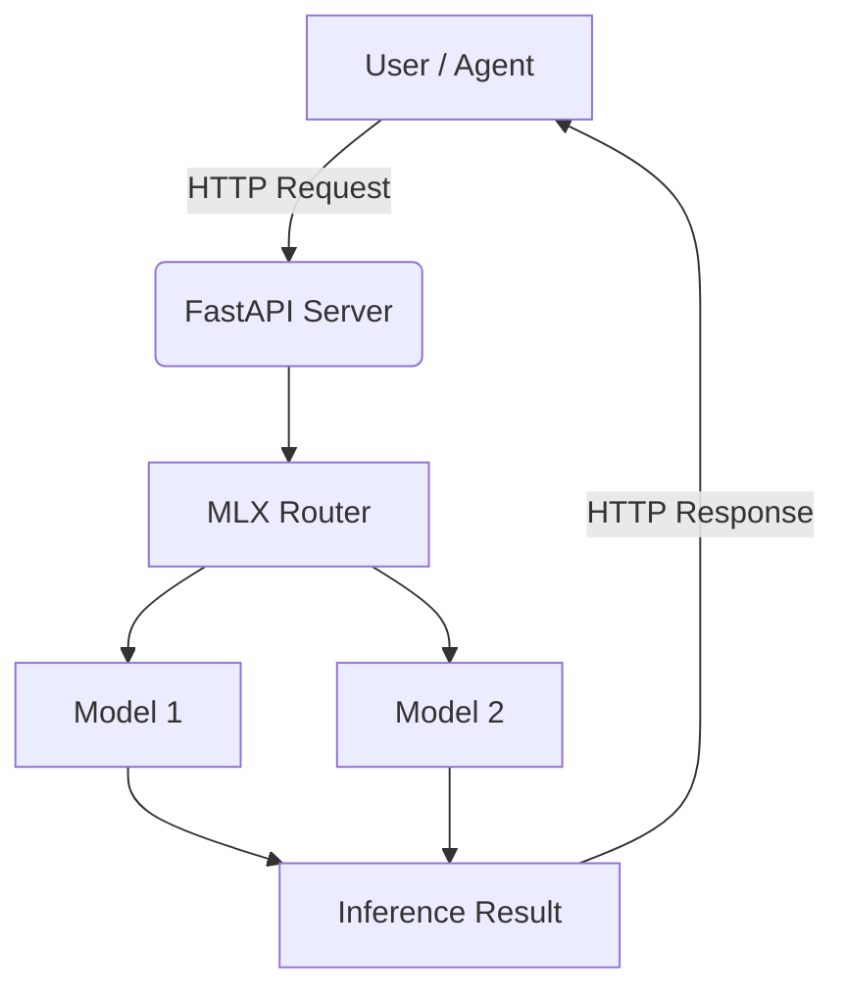

# MLX Router

[](https://www.python.org/downloads/)
[](https://github.com/ml-explore/mlx)
[](https://fastapi.tiangolo.com/)
[](https://opensource.org/licenses/MIT)
[](https://github.com/henrybravo/mlx-router)

A powerful and efficient server for dynamically **routing API requests to multiple MLX models**, powered by FastAPI. Beyond routing, it's a **high-performance server**, leveraging GPU acceleration and robust features for local inference.


## Features

- 🚀 **FastAPI-powered** - Modern async API with automatic documentation
- 🔄 Hot-swap between different models without server restart
- ⚡ MLX-optimized performance with GPU acceleration
- 🔒 Automatic memory management and cleanup
- 🎯 **Full OpenAI API compatibility** - Drop-in replacement for OpenAI endpoints
- ⏱️ Built-in timeout protection and error handling
- 📊 Comprehensive logging system with rotation
- 🏗️ **Modular architecture** - Clean separation of concerns
- 📖 **Interactive API docs** - Automatic Swagger/OpenAPI documentation
- 🔧 **System service support** - Install as macOS launchd service with automatic startup and crash recovery
- 🌊 **Response Streaming** - Real-time token delivery with Server-Sent Events (90%+ latency reduction)
- 🔧 **Function Calling** - OpenAI-compatible tool/function calling for agent frameworks

## Supported Models

MLX Router supports **any MLX model** that is available locally. Models are automatically discovered from configured directories and can be loaded dynamically without server restart.

### Local Model Directory Support (v2.1.2)

Models are loaded from local directories (default: `$HOME/models`) with automatic configuration detection:

- **Automatic Discovery**: Models placed in the configured directory are automatically detected
- **Dynamic Configuration**: Model parameters are extracted from local `config.json` files
- **Hot-Swapping**: Switch between models without restarting the server
- **Fallback Support**: Downloads any HuggingFace model to the custom directory if not found locally
- **Cache Management**: Existing models in `~/.cache/huggingface/hub` can be symlinked to the custom directory

### Currently Configured Models

The router comes pre-configured with these locally available models:

- `mlx-community/Llama-3.3-70B-Instruct-4bit` (40GB RAM)
- `mlx-community/Qwen3-30B-A3B-8bit` (18GB RAM)
- `mlx-community/Phi-4-reasoning-plus-6bit` (12GB RAM)
- `deepseek-ai/deepseek-coder-6.7b-instruct` (8GB RAM)

### Model Directory Structure

```
$HOME/models/
├── mlx-community--Llama-3.3-70B-Instruct-4bit/
│   └── snapshots/
│       └── [commit-hash]/
│           ├── config.json
│           ├── tokenizer.json
│           └── model.safetensors
└── custom-models/
    └── my-model/
        ├── config.json
        ├── tokenizer.json
        └── model.safetensors
```

Use the `--config` argument to load additional model configurations from `config.json`.

You can use the helper tools in `helper_tools/` directory:
- `mlx_downloader.py` - Download MLX models to custom directories (supports `MLX_MODEL_DIR`)
- `mlx_lmstudio_linker.py` - Link models to LM Studio
- `mlx_model_parameter_discovery_tool.py` - Auto-discover optimal parameters

## Architecture



The project features a clean modular architecture:

### Package Structure
```
mlx_router/
├── config/          # Configuration management
│   └── model_config.py
├── core/            # Core MLX logic
│   ├── model_manager.py
│   └── resource_monitor.py
└── api/             # FastAPI application
    └── app.py
```

### Core Components
- **MLXModelManager**: Central class managing model loading, unloading, and generation with thread-safe operations
- **ModelConfig**: Configuration management for model-specific parameters
- **ResourceMonitor**: Apple Silicon memory monitoring and optimization
- **FastAPI App**: Modern HTTP API with automatic documentation

### Configuration System
- **config.json**: External configuration file for model parameters, defaults, and operational settings
- Model-specific parameters include: max_tokens, temperature, top_p, top_k, min_p, chat_template, required_memory_gb
- Memory pressure-aware token limits for different system states

### Chat Template System
The router supports multiple chat template formats:
- `llama3`: Llama 3.x models with `<|begin_of_text|>` format
- `deepseek`: DeepSeek models with instruction/response format
- `qwen`: Qwen models with `<|im_start|>` format  
- `phi4`: Phi-4 models with `<|user|>/<|assistant|>` format
- `generic`: Fallback template


## Prerequisites

- Python 3.11+ (tested with 3.11 and 3.13)
- MLX-compatible GPU
- `uv` package manager (recommended)

## Installation

### Development Installation

1. Clone the repository:
```bash
git clone https://github.com/henrybravo/mlx-router.git
cd mlx-router
```

2. Set up the environment using `uv`:
```bash
pip install uv
uv venv --python 3.11
source .venv/bin/activate
uv pip install -r requirements.txt
```

### System Service Installation (macOS)

For production deployment as a user service that starts automatically:

**Prerequisites:**
- macOS (Darwin-based system)
- Python 3.11+ installed
- `uv` package manager (optional, but recommended for faster installation)

```bash
# Install as a user service (no sudo required)
./install-launchd.sh

# Check service status
launchctl list | grep mlx-router

# View logs
tail -f ~/mlx_router_app/logs/mlx_router.log
```

**Installation Features:**
- ✅ **Automatic dependency checking**: Validates Python version and required files
- ⚡ **uv support**: Uses `uv` for faster package installation if available, falls back to pip
- 🔄 **Existing service handling**: Safely handles reinstallation over existing services
- 🧪 **Installation verification**: Tests service startup and API availability
- 🔧 **Self-healing dependencies**: Automatically detects and fixes missing Python packages
- 🎯 **Application testing**: Verifies main.py imports work before service installation
- 🏠 **User-space installation**: Installs to `~/mlx_router_app` without requiring elevated privileges

**Configuration in Production Mode:**

The installation script automatically:
- Copies `config.json` to `~/mlx_router_app/config.json`
- Configures the service to use this user-level config file
- The service runs with `--config ~/mlx_router_app/config.json`
- **Enables automatic restart**: Service automatically restarts if the application crashes
- **Login persistence**: Service starts automatically when you log in

**Modifying Production Configuration:**
```bash
# Backup current config (recommended)
cp ~/mlx_router_app/config.json ~/mlx_router_app/config.json.backup

# Edit the production config file
nano ~/mlx_router_app/config.json

# Restart service to apply changes
launchctl unload ~/Library/LaunchAgents/com.henrybravo.mlx-router.plist
launchctl load ~/Library/LaunchAgents/com.henrybravo.mlx-router.plist

# Verify changes in logs
tail -f ~/mlx_router_app/logs/mlx-router.log
```

**Service Management:**
```bash
# Stop service
launchctl unload ~/Library/LaunchAgents/com.henrybravo.mlx-router.plist

# Start service
launchctl load ~/Library/LaunchAgents/com.henrybravo.mlx-router.plist

# Uninstall service
./uninstall-launchd.sh
```

**Custom Installation Directory:**
```bash
# Install to a custom directory
INSTALL_DIR=/path/to/custom/dir ./install-launchd.sh

# Or set the environment variable first
export INSTALL_DIR=/path/to/custom/dir
./install-launchd.sh
```

## Usage

### Development Mode

*Optionally: view help menu first:*
```bash
python main.py -h
```

1. Start the server:
```bash
python main.py --config config.json
```

### Production Mode (User Service)

Once installed as a user service, MLX Router runs automatically and can be accessed immediately:
```bash
# Service runs automatically after installation
# Access API directly
curl -s http://localhost:8800/health | jq
```

### Access Points

The server will start on `http://0.0.0.0:8800` by default.
- **Swagger UI**: http://localhost:8800/docs
- **ReDoc**: http://localhost:8800/redoc

### API Endpoints

- `GET /v1/models` - List available models with memory requirements
- `POST /v1/chat/completions` - Generate chat completions (OpenAI compatible)
- `GET /health` - Server health check
- `GET /v1/health` - Detailed health metrics

### Example API Usage

**List Models:**
```bash
curl -s http://localhost:8800/v1/models | jq
```

**Chat Completion:**
```bash
curl -s -X POST http://localhost:8800/v1/chat/completions \
  -H "Content-Type: application/json" \
  -d '{
    "model": "mlx-community/Llama-3.2-3B-Instruct-4bit",
    "messages": [
      {"role": "user", "content": "Hello, how are you?"}
    ],
    "temperature": 0.7,
    "max_tokens": 1000
  }' | jq
```

**Streaming Response:**
```bash
curl -s -X POST http://localhost:8800/v1/chat/completions \
  -H "Content-Type: application/json" \
  -d '{
    "model": "mlx-community/Llama-3.2-3B-Instruct-4bit",
    "messages": [
      {"role": "user", "content": "Write a short poem about technology"}
    ],
    "stream": true,
    "max_tokens": 100
  }'
```

**Function Calling:**
```bash
curl -s -X POST http://localhost:8800/v1/chat/completions \
  -H "Content-Type: application/json" \
  -d '{
    "model": "mlx-community/Llama-3.2-3B-Instruct-4bit",
    "messages": [
      {"role": "user", "content": "What is the weather like in San Francisco?"}
    ],
    "tools": [
      {
        "type": "function",
        "function": {
          "name": "get_weather",
          "description": "Get current weather information for a location",
          "parameters": {
            "type": "object",
            "properties": {
              "location": {
                "type": "string",
                "description": "The city and state, e.g. San Francisco, CA"
              },
              "units": {
                "type": "string",
                "enum": ["celsius", "fahrenheit"],
                "description": "Temperature units"
              }
            },
            "required": ["location"]
          }
        }
      }
    ],
    "max_tokens": 150
  }' | jq
```

**Health Check:**
```bash
curl -s http://localhost:8800/health | jq
```

## Configuration

The `config.json` file allows you to:
- Define model-specific parameters (temperature, max_tokens, etc.)
- Set memory pressure thresholds for different system states
- Configure default values and operational settings
- Add new models with custom chat templates

### Configuration Locations

**Development Mode:**
- Use local `config.json` in project directory
- Specify with `python main.py --config config.json`

**Production Mode (User Service):**
- Configuration automatically copied to `~/mlx_router_app/config.json`
- Service configured to use this user-level config
- Edit with: `nano ~/mlx_router_app/config.json`
- Restart service after changes to apply modifications

Example configuration structure:
```json
{
  "defaults": {
    "max_tokens": 8192,
    "timeout": 120,
    "cache_size": 2,
    "memory_threshold_gb": 2.0,
    "swap_critical_percent": 95.0,
    "swap_high_percent": 85.0,
    "stream": false,
    "enable_function_calling": true,
    "model": "mlx-community/Llama-3.3-70B-Instruct-4bit",
    "stream_chunk_size": 32,
    "warmup_tokens": 5,
    "model_directory": "/Users/username/models"
  },
  "server": {
      "ip": "10.3.2.1",
      "port": 8800,
      "debug": false
  },
  "models": {
    "mlx-community/Llama-3.3-70B-Instruct-4bit": {
      "max_tokens": 8192,
      "temp": 0.7,
      "top_p": 0.95,
      "top_k": 50,
      "min_p": 0.05,
      "chat_template": "llama3",
      "required_memory_gb": 40,
      "supports_tools": true,
      "memory_pressure_max_tokens": {
        "normal": 4096,
        "moderate": 2048,
        "high": 1024,
        "critical": 512
      }
    },
    "deepseek-ai/deepseek-coder-6.7b-instruct": {
      "max_tokens": 4096,
      "temp": 0.1,
      "top_p": 0.95,
      "top_k": 20,
      "min_p": 0.1,
      "chat_template": "deepseek",
      "required_memory_gb": 8,
      "supports_tools": true
    }
    }
}
```

### Memory Pressure Management

Memory pressure management is a critical feature in MLX Router that enables efficient operation on Apple Silicon systems with varying amounts of RAM. This system prevents system instability by dynamically adjusting model behavior based on current memory usage.

#### What is Memory Pressure?

Memory pressure refers to the strain placed on a system's RAM and swap resources. In the context of MLX Router, memory pressure monitoring prevents system instability by:

- **Preventing model loading failures** when insufficient RAM is available
- **Adjusting token limits dynamically** based on current memory usage
- **Maintaining system responsiveness** during model inference
- **Optimizing performance** across different Apple Silicon configurations

#### Memory Pressure Levels

MLX Router classifies memory pressure into four levels based on available memory and swap usage:

**Memory-based thresholds** (compared to `memory_threshold_gb`):
- **`normal`**: Available memory ≥ `memory_threshold_gb` (e.g., ≥80GB)
- **`moderate`**: Available memory ≥ `memory_threshold_gb * 0.8` (e.g., ≥64GB)
- **`high`**: Available memory ≥ `memory_threshold_gb * 0.6` (e.g., ≥48GB)
- **`critical`**: Available memory < `memory_threshold_gb * 0.6` (e.g., <48GB)

**Swap-based thresholds** (configurable via `swap_critical_percent` and `swap_high_percent`):
- **`critical`**: Swap usage > `swap_critical_percent` (default: 90%)
- **`high`**: Swap usage > `swap_high_percent` (default: 75%)

Memory pressure is determined by the worst condition (highest pressure level) from both memory and swap thresholds.

#### Memory Monitoring Components

The system monitors several key metrics:

- **Total/Available/Free RAM**: Basic memory statistics
- **Swap Usage**: Virtual memory utilization
- **Memory Fragmentation**: Calculated score (0-100) indicating memory efficiency
- **Safety Margins**: Multipliers applied to required memory calculations

#### Dynamic Token Limits

Each model can have different `max_tokens` limits based on memory pressure:

```json
"memory_pressure_max_tokens": {
  "normal": 16384,
  "moderate": 8192,
  "high": 4096,
  "critical": 2048
}
```

When memory pressure increases, the system automatically reduces token limits to prevent memory exhaustion during generation.

#### System-Specific Configuration Examples

**16GB RAM Systems (MacBook Air/Pro base models):**
```json
{
  "defaults": {
    "memory_threshold_gb": 12.0,
    "swap_critical_percent": 95.0,
    "swap_high_percent": 85.0
  },
  "models": {
    "mlx-community/Llama-3.2-3B-Instruct-4bit": {
      "required_memory_gb": 4,
      "max_tokens": 4096,
      "memory_pressure_max_tokens": {
        "normal": 4096,
        "moderate": 2048,
        "high": 1024,
        "critical": 512
      }
    }
  }
}
```

**32GB RAM Systems (MacBook Pro, Mac Mini):**
```json
{
  "defaults": {
    "memory_threshold_gb": 24.0,
    "swap_critical_percent": 95.0,
    "swap_high_percent": 85.0
  },
  "models": {
    "mlx-community/Qwen3-30B-A3B-8bit": {
      "required_memory_gb": 18,
      "max_tokens": 8192,
      "memory_pressure_max_tokens": {
        "normal": 8192,
        "moderate": 4096,
        "high": 2048,
        "critical": 1024
      }
    }
  }
}
```

**64GB+ RAM Systems (Mac Studio, high-end Mac Pro):**
```json
{
  "defaults": {
    "memory_threshold_gb": 48.0,
    "swap_critical_percent": 99.0,
    "swap_high_percent": 90.0
  },
  "models": {
    "mlx-community/Llama-3.3-70B-Instruct-4bit": {
      "required_memory_gb": 35,
      "max_tokens": 12288,
      "memory_pressure_max_tokens": {
        "normal": 12288,
        "moderate": 8192,
        "high": 4096,
        "critical": 2048
      }
    }
  }
}
```

#### Best Practices

1. **Monitor Memory Usage**: Use `/health` endpoint to track memory pressure levels
2. **Choose Appropriate Models**: Don't load models requiring more than 80% of available RAM
3. **Configure Token Limits**: Set conservative limits for memory-constrained systems
4. **Watch Fragmentation**: High fragmentation scores (>70) indicate memory inefficiency

For comprehensive memory pressure management details, see the [Memory Pressure Tutorial](https://github.com/henrybravo/mlx-router/blob/main/docs/memory-pressure-tutorial.md).

### Model Directory Configuration

- **`model_directory`**: Path to local model storage (default: `"$HOME/models"`)
- **Environment Variable**: `MLX_MODEL_DIR` can override the config setting
- **Automatic Discovery**: Models placed in this directory are automatically detected
- **HuggingFace Cache Format**: Supports both direct directories and HF cache naming (`models--org--model`)

## Logging

### Development Mode
Logs are written to both console and `logs/mlx_router.log` file.

### Production Mode (User Service)
Logs are written to application log files:
- **Standard Output**: `~/mlx_router_app/logs/mlx_router.log`
- **Error Output**: `~/mlx_router_app/logs/mlx_router.error.log`

**Log Information:**
- Model loading/unloading with timing metrics
- API requests with unique request IDs
- Generation statistics and performance metrics
- Memory pressure monitoring and adjustments
- Comprehensive error tracking with stack traces

**View Logs:**
```bash
# Real-time monitoring
tail -f ~/mlx_router_app/logs/mlx_router.log

# View recent entries
tail -50 ~/mlx_router_app/logs/mlx_router.log

# Check for errors
tail -50 ~/mlx_router_app/logs/mlx_router.error.log
```

## Crash Recovery & Reliability

### Automatic Restart (Production Mode)

The launchd service is configured with `KeepAlive=true`, providing robust crash recovery:

- **Automatic Restart**: If the Python process crashes (malloc errors, segfaults, etc.), launchd automatically restarts the service
- **Login Persistence**: Service starts automatically when you log in
- **Process Monitoring**: launchd continuously monitors the process health
- **Crash Logging**: All crashes and restarts are logged to `~/mlx_router_app/logs/mlx_router.error.log`

**Monitor Crash Recovery:**
```bash
# Watch for service restarts in real-time
tail -f ~/mlx_router_app/logs/mlx_router.log | grep -E "(Starting|Stopping|Error)"

# Check crash history
grep -i "crash\|error\|restart" ~/mlx_router_app/logs/mlx_router.error.log

# View service status and restart count
launchctl print gui/$(id -u)/com.henrybravo.mlx-router
```

**Example Crash Recovery Flow:**
1. Application crashes due to memory error or segfault
2. launchd detects process termination
3. Service automatically restarts within seconds
4. API becomes available again without manual intervention
5. Crash details logged for debugging

## Installation Testing

A comprehensive testing guide is available in `INSTALL_TEST.md`. For quick verification:

```bash
# Test system service installation
./install-launchd.sh

# Verify endpoints are responding
curl -s http://localhost:8800/health | jq
curl -s http://localhost:8800/v1/models | jq

# Test chat completion
curl -s -X POST http://localhost:8800/v1/chat/completions \
  -H "Content-Type: application/json" \
  -d '{
    "model": "mlx-community/Llama-3.2-3B-Instruct-4bit",
    "messages": [{"role": "user", "content": "Hello!"}],
    "max_tokens": 50
  }' | jq
```

## Troubleshooting

### Service Issues
```bash
# Check service status
launchctl print gui/$(id -u)/com.henrybravo.mlx-router

# Manual start for debugging
~/mlx_router_app/venv/bin/python \
  ~/mlx_router_app/main.py \
  --config ~/mlx_router_app/config.json

# Restart service
launchctl unload ~/Library/LaunchAgents/com.henrybravo.mlx-router.plist
launchctl load ~/Library/LaunchAgents/com.henrybravo.mlx-router.plist
```

### Common Issues

**Installation Issues:**
- **Python version too old**: Install Python 3.11+ before running the install script
- **Missing files**: Ensure all required files are present in the project directory
- **Permission denied**: The install script now runs in user space and doesn't require sudo
- **uv not found warning**: Install `uv` globally with `pip install uv` for faster installation (optional)
- **Missing dependencies**: The install script automatically detects and fixes missing dependencies
- **Installation failure**: Re-run `./install-launchd.sh` - it includes self-healing dependency resolution

**Runtime Issues:**
- **Service won't start**: Check error logs and verify Python dependencies
- **API not responding**: Ensure port 8800 is available and not blocked
- **Model loading fails**: Verify models exist and have sufficient memory
- **Config changes not applied**: Restart the service after modifying `~/mlx_router_app/config.json`
- **Invalid config format**: Validate JSON syntax with `python -m json.tool ~/mlx_router_app/config.json`
- **Memory-related crashes**: MLX memory errors automatically trigger service restart (production mode)
- **Frequent crashes**: Check error logs for patterns and ensure sufficient system memory for models

## Agent Framework Integration

MLX Router's OpenAI-compatible API enables seamless integration with popular agent frameworks and AI applications:

- 🔒 **Complete data privacy** - All processing happens locally
- ⚡ **GPU acceleration** - Apple Silicon optimized inference  
- 🔄 **Hot-swappable models** - Switch models without restarting agents
- 🛠️ **Drop-in replacement** - Works with any OpenAI-compatible client
- 🌊 **Streaming support** - Real-time token delivery for responsive UX
- 🔧 **Function calling** - Tool integration for advanced agent workflows

For comprehensive setup guides and examples, see **[AGENTS.md](AGENTS.md)**

**Supported Frameworks:**
- **Microsoft Semantic Kernel** - Native OpenAI connector integration with streaming and tools
- **Strands** - Custom model provider with conversation memory and function calling
- **LangChain** - Chat model integration with chains, agents, streaming, and tools
- **OpenWebUI** - Web interface for local LLM interactions with streaming support
- **Goose** - AI-powered developer assistant for terminal environments

## What's New in v2.1.2

**📁 Custom Model Directory Loading**
- **Local Model Support** - Load models from any local directory (default: `$HOME/models`)
- **Automatic Discovery** - Models placed in configured directory are automatically detected
- **Dynamic Configuration** - Model parameters extracted from local `config.json` files
- **HuggingFace Cache Compatible** - Supports both direct directories and HF cache naming
- **Environment Variable Support** - `MLX_MODEL_DIR` for custom directory configuration
- **Hot-Swapping** - Switch between local models without server restart

## What's New in v2.1.3

**🌊 Enhanced Response Streaming**
- **Multiple streaming formats** - Choose between SSE, JSON Lines, or JSON Array formats
- **Goose/OpenWebUI compatibility** - JSON Array format works with clients that use `response.json()`
- **Real-time token delivery** - 90%+ reduction in time-to-first-token
- **Server-Sent Events** - OpenAI-compatible streaming format (default)
- **Async generators** - Non-blocking streaming with FastAPI
- **Memory efficient** - Reduced peak memory usage during generation

### Streaming Format Configuration

MLX Router supports three streaming formats for maximum client compatibility:

| Format | Configuration | Best For | Response Type |
|--------|---------------|----------|---------------|
| **SSE** (default) | `"streaming_format": "sse"` | curl, Python requests | `data: {json}\n\n...` |
| **JSON Lines** | `"streaming_format": "json_lines"` | Advanced clients | `{json}\n{json}\n...` |
| **JSON Array** | `"streaming_format": "json_array"` | Goose, OpenWebUI | `{"object": "chat.completion", "choices": [...]}` |

**For Goose/OpenWebUI compatibility:**
```json
{
  "defaults": {
    "streaming_format": "json_array"
  }
}
```

**🔧 Function Calling**
- **OpenAI-compatible** - Full compliance with function calling API
- **Prompt engineering** - Tool instructions injected into model prompts
- **JSON parsing** - Robust extraction and validation of tool calls
- **Schema validation** - Tool arguments validated against provided schemas
- **Error resilience** - Graceful fallback to text responses

**Previous v2.0 Features:**
- **FastAPI Integration** - Modern async API framework with automatic documentation
- **Modular Architecture** - Clean separation into config/, core/, and api/ modules
- **Enhanced Error Handling** - Comprehensive HTTP status codes and error responses
- **Interactive Documentation** - Built-in Swagger UI and ReDoc interfaces
- **Improved Performance** - Async request handling and optimized memory management
- **Better Monitoring** - Enhanced health endpoints with detailed system metrics

## Contributing

Contributions are welcome! Please feel free to submit a Pull Request or open an Issue.

## License

MIT License