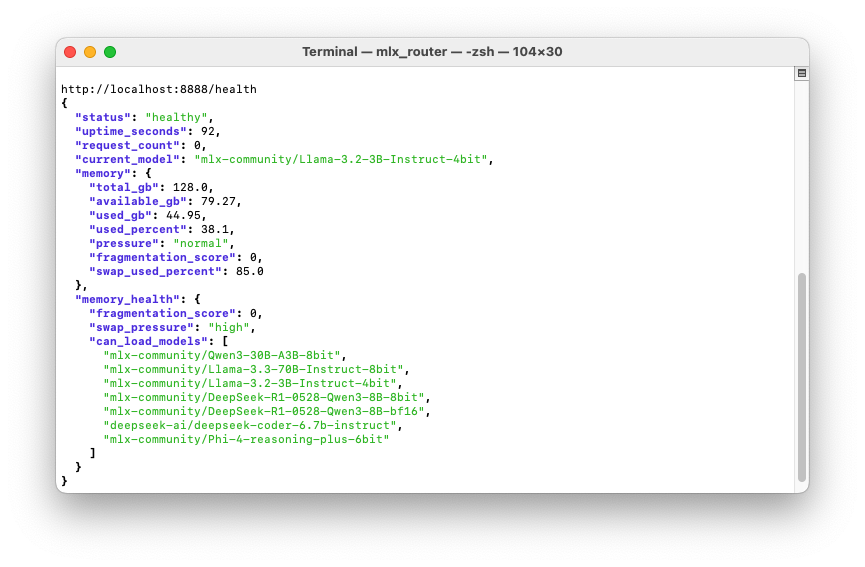

# mlx-project
Useful scripts to ease the use of mlx

## MLX Model Router

A powerful and efficient server for managing and serving multiple MLX models through a unified API interface. This project provides a simple way to load, switch between, and serve different MLX models with optimized performance.


## Features

- 🚀 Serve multiple MLX models through a single API endpoint
- 🔄 Hot-swap between different models without server restart
- ⚡ MLX-optimized performance with GPU acceleration
- 🔒 Automatic memory management and cleanup
- 🎯 Compatible with OpenAI-style API endpoints
- ⏱️ Built-in timeout protection and error handling
- 📊 Comprehensive logging system

## Supported Models

Any mlx model that is available locally and added to the list (in the script). As an example the router currently supports the following models:
- `mlx-community/Qwen3-30B-A3B-8bit`
- `mlx-community/Llama-3.3-70B-Instruct-8bit`
- `mlx-community/Llama-3.2-3B-Instruct-4bit`
- `mlx-community/DeepSeek-R1-0528-Qwen3-8B-8bit`
- `mlx-community/DeepSeek-R1-0528-Qwen3-8B-bf16`
- `deepseek-ai/deepseek-coder-6.7b-instruct`
- `mlx-community/Phi-4-reasoning-plus-6bit`

You can use the `--config` argument that will override the model configuration in `mlx_router.py` if used.

You can use the `mlx_downloader.py` script to download the models.

## Key Architecture Components

### Core Server (`mlx_router.py`)
- **MLXModelManager**: Central class managing model loading, unloading, and generation with thread-safe operations
- **APIHandler**: HTTP request handler implementing OpenAI-compatible endpoints (`/v1/models`, `/v1/chat/completions`)
- **ModelConfig**: Static configuration class defining model-specific parameters (max_tokens, temperature, chat templates)
- **ResourceMonitor**: Apple Silicon memory monitoring and optimization

### Configuration System
- **config.json**: External configuration file for model parameters, defaults, and operational settings
- **ModelConfig.MODELS**: Hardcoded model configurations with chat templates and resource requirements
- Model-specific parameters include: max_tokens, temperature, top_p, top_k, min_p, chat_template, required_memory_gb

### Chat Template System
The router supports multiple chat template formats:
- `llama3`: Llama 3.x models with `<|begin_of_text|>` format
- `deepseek`: DeepSeek models with instruction/response format
- `qwen`: Qwen models with `<|im_start|>` format  
- `phi4`: Phi-4 models with `<|user|>/<|assistant|>` format
- `generic`: Fallback template



## Prerequisites

- Python 3.10+ (tested with 3.11 and 3.13)
- MLX-compatible GPU
- `uv` package manager (recommended)

## Installation

1. Clone the repository:
```bash
git clone <repository-url>
cd mlx-project
```

2. Set up the environment using `uv`:
```bash
pip install uv
uv venv --python 3.11 # uv venv
source .venv/bin/activate
uv pip install -r requirements.txt
```

## Usage

1. Open the help menu:
```bash
python mlx_router.py -h 
```

2. Start the server:
```bash
python mlx_router.py
```

The server will start on `http://0.0.0.0:8800` by default.

3. API Endpoints:

- `GET /v1/models` - List available models
- `POST /v1/chat/completions` - Generate completions

Example API request:
```bash
curl -s -X POST http://localhost:8800/v1/chat/completions \
  -H "Content-Type: application/json" \
  -d '{
    "model": "mlx-community/Llama-3.2-3B-Instruct-4bit",
    "messages": [
      {"role": "user", "content": "Hello, how are you?"}
    ]
  }' | jq
```

## Configuration

The server includes several optimizations for each configured model and you can override and expand by using a config file.

## Logging

Logs are written to both console and `mlx_router.log` file, providing detailed information about i.e.:
- Model loading/unloading
- API requests
- Generation statistics
- Error tracking

## Contributing

Contributions are welcome! Please feel free to submit a Pull Request.

## License

MIT License