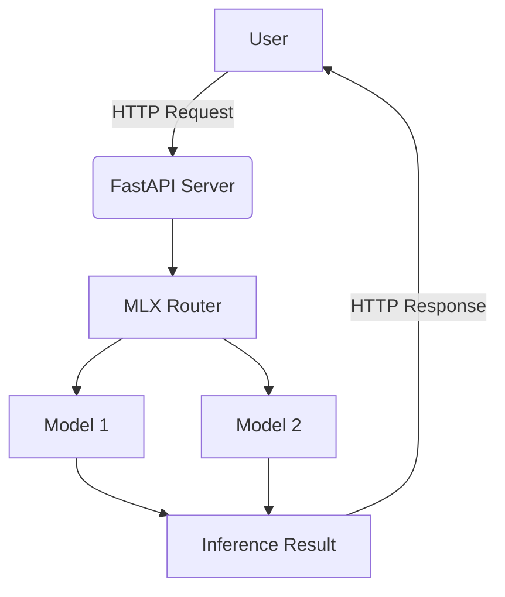

# MLX Router

A powerful and efficient server for dynamically **routing API requests to multiple MLX models**, powered by FastAPI. Beyond routing, it’s a **high-performance server**, leveraging GPU acceleration and robust features for local inference.


## Features

- 🚀 **FastAPI-powered** - Modern async API with automatic documentation
- 🔄 Hot-swap between different models without server restart
- ⚡ MLX-optimized performance with GPU acceleration
- 🔒 Automatic memory management and cleanup
- 🎯 **Full OpenAI API compatibility** - Drop-in replacement for OpenAI endpoints
- ⏱️ Built-in timeout protection and error handling
- 📊 Comprehensive logging system with rotation
- 🏗️ **Modular architecture** - Clean separation of concerns
- 📖 **Interactive API docs** - Automatic Swagger/OpenAPI documentation
- 🔧 **System service support** - Install as macOS launchd service with automatic startup and crash recovery

## Supported Models

Any mlx model that is available locally and added to the list (in the script). As an example the router currently supports the following models:
- `mlx-community/Qwen3-30B-A3B-8bit`
- `mlx-community/Llama-3.3-70B-Instruct-8bit`
- `mlx-community/Llama-3.2-3B-Instruct-4bit`
- `mlx-community/DeepSeek-R1-0528-Qwen3-8B-8bit`
- `mlx-community/DeepSeek-R1-0528-Qwen3-8B-bf16`
- `deepseek-ai/deepseek-coder-6.7b-instruct`
- `mlx-community/Phi-4-reasoning-plus-6bit`

You can use the `--config` argument to load external model configurations from `config.json`.

You can use the helper tools in `helper_tools/` directory:
- `mlx_downloader.py` - Download MLX models
- `mlx_lmstudio_linker.py` - Link models to LM Studio
- `mlx_model_parameter_discovery_tool.py` - Auto-discover optimal parameters

## Architecture



The project features a clean modular architecture:

### Package Structure
```
mlx_router/
├── config/          # Configuration management
│   └── model_config.py
├── core/            # Core MLX logic
│   ├── model_manager.py
│   └── resource_monitor.py
└── api/             # FastAPI application
    └── app.py
```

### Core Components
- **MLXModelManager**: Central class managing model loading, unloading, and generation with thread-safe operations
- **ModelConfig**: Configuration management for model-specific parameters
- **ResourceMonitor**: Apple Silicon memory monitoring and optimization
- **FastAPI App**: Modern HTTP API with automatic documentation

### Configuration System
- **config.json**: External configuration file for model parameters, defaults, and operational settings
- Model-specific parameters include: max_tokens, temperature, top_p, top_k, min_p, chat_template, required_memory_gb
- Memory pressure-aware token limits for different system states

### Chat Template System
The router supports multiple chat template formats:
- `llama3`: Llama 3.x models with `<|begin_of_text|>` format
- `deepseek`: DeepSeek models with instruction/response format
- `qwen`: Qwen models with `<|im_start|>` format  
- `phi4`: Phi-4 models with `<|user|>/<|assistant|>` format
- `generic`: Fallback template


## Prerequisites

- Python 3.10+ (tested with 3.11 and 3.13)
- MLX-compatible GPU
- `uv` package manager (recommended)

## Installation

### Development Installation

1. Clone the repository:
```bash
git clone https://github.com/henrybravo/mlx-router.git
cd mlx-router
```

2. Set up the environment using `uv`:
```bash
pip install uv
uv venv --python 3.11 # uv venv
source .venv/bin/activate
uv pip install -r requirements.txt
```

### System Service Installation (macOS)

For production deployment as a system service that starts automatically:

**Prerequisites:**
- macOS (Darwin-based system)
- Python 3.10+ installed
- `uv` package manager (optional, but recommended for faster installation)

```bash
# Install as a system service
./install-launchd.sh

# Check service status
sudo launchctl list | grep mlx-router

# View logs
tail -f /usr/local/opt/mlx-router/logs/mlx_router.log
```

**Installation Features:**
- ✅ **Automatic dependency checking**: Validates Python version and required files
- ⚡ **uv support**: Uses `uv` for faster package installation if available, falls back to pip
- 🔄 **Existing service handling**: Safely handles reinstallation over existing services
- 🧪 **Installation verification**: Tests service startup and API availability
- 🔧 **Self-healing dependencies**: Automatically detects and fixes missing Python packages
- 🎯 **Application testing**: Verifies main.py imports work before service installation

**Configuration in Production Mode:**

The installation script automatically:
- Copies `config.json` to `/usr/local/etc/mlx-router/config.json`
- Configures the service to use this system-level config file
- The service runs with `--config /usr/local/etc/mlx-router/config.json`
- **Enables automatic restart**: Service automatically restarts if the application crashes
- **Boot persistence**: Service starts automatically when the system boots

**Modifying Production Configuration:**
```bash
# Backup current config (recommended)
cp /usr/local/etc/mlx-router/config.json /usr/local/etc/mlx-router/config.json.backup

# Edit the production config file
nano /usr/local/etc/mlx-router/config.json

# Restart service to apply changes
sudo launchctl unload /Library/LaunchDaemons/com.henrybravo.mlx-router.plist
sudo launchctl load /Library/LaunchDaemons/com.henrybravo.mlx-router.plist

# Verify changes in logs
tail -f /usr/local/opt/mlx-router/logs/mlx-router.log
```

**Service Management:**
```bash
# Stop service
sudo launchctl unload /Library/LaunchDaemons/com.henrybravo.mlx-router.plist

# Start service
sudo launchctl load /Library/LaunchDaemons/com.henrybravo.mlx-router.plist

# Uninstall service
./uninstall-launchd.sh
```

## Usage

### Development Mode

*Optionally: view help menu first:*
```bash
python main.py -h
```

1. Start the server:
```bash
python main.py --config config.json
```

### Production Mode (System Service)

Once installed as a system service, MLX Router runs automatically and can be accessed immediately:
```bash
# Service runs automatically after installation
# Access API directly
curl -s http://localhost:8800/health | jq
```

### Access Points

The server will start on `http://0.0.0.0:8800` by default.
- **Swagger UI**: http://localhost:8800/docs
- **ReDoc**: http://localhost:8800/redoc

### API Endpoints

- `GET /v1/models` - List available models with memory requirements
- `POST /v1/chat/completions` - Generate chat completions (OpenAI compatible)
- `GET /health` - Server health check
- `GET /v1/health` - Detailed health metrics

### Example API Usage

**List Models:**
```bash
curl -s http://localhost:8800/v1/models | jq
```

**Chat Completion:**
```bash
curl -s -X POST http://localhost:8800/v1/chat/completions \
  -H "Content-Type: application/json" \
  -d '{
    "model": "mlx-community/Llama-3.2-3B-Instruct-4bit",
    "messages": [
      {"role": "user", "content": "Hello, how are you?"}
    ],
    "temperature": 0.7,
    "max_tokens": 1000
  }' | jq
```

**Health Check:**
```bash
curl -s http://localhost:8800/health | jq
```

## Configuration

The `config.json` file allows you to:
- Define model-specific parameters (temperature, max_tokens, etc.)
- Set memory pressure thresholds for different system states
- Configure default values and operational settings
- Add new models with custom chat templates

### Configuration Locations

**Development Mode:**
- Use local `config.json` in project directory
- Specify with `python main.py --config config.json`

**Production Mode (System Service):**
- Configuration automatically copied to `/usr/local/etc/mlx-router/config.json`
- Service configured to use this system-level config
- Edit with: `sudo nano /usr/local/etc/mlx-router/config.json`
- Restart service after changes to apply modifications

Example configuration structure:
```json
{
  "defaults": {
    "max_tokens": 4096,
    "timeout": 120
  },
  "models": {
    "model-name": {
      "max_tokens": 8192,
      "temp": 0.7,
      "chat_template": "llama3",
      "required_memory_gb": 8
    }
  }
}
```

## Logging

### Development Mode
Logs are written to both console and `logs/mlx_router.log` file with rotation.

### Production Mode (System Service)
Logs are written to application log files:
- **Standard Output**: `/usr/local/opt/mlx-router/logs/mlx_router.log`
- **Error Output**: `/usr/local/opt/mlx-router/logs/mlx_router.error.log`

**Log Information:**
- Model loading/unloading with timing metrics
- API requests with unique request IDs
- Generation statistics and performance metrics
- Memory pressure monitoring and adjustments
- Comprehensive error tracking with stack traces

**View Logs:**
```bash
# Real-time monitoring
tail -f /usr/local/opt/mlx-router/logs/mlx_router.log

# View recent entries
tail -50 /usr/local/opt/mlx-router/logs/mlx_router.log

# Check for errors
tail -50 /usr/local/opt/mlx-router/logs/mlx_router.error.log
```

## Crash Recovery & Reliability

### Automatic Restart (Production Mode)

The launchd service is configured with `KeepAlive=true`, providing robust crash recovery:

- **Automatic Restart**: If the Python process crashes (malloc errors, segfaults, etc.), launchd automatically restarts the service
- **Boot Persistence**: Service starts automatically when the system boots
- **Process Monitoring**: launchd continuously monitors the process health
- **Crash Logging**: All crashes and restarts are logged to `/usr/local/opt/mlx-router/logs/mlx_router.error.log`

**Monitor Crash Recovery:**
```bash
# Watch for service restarts in real-time
tail -f /usr/local/opt/mlx-router/logs/mlx_router.log | grep -E "(Starting|Stopping|Error)"

# Check crash history
grep -i "crash\|error\|restart" /usr/local/opt/mlx-router/logs/mlx_router.error.log

# View service status and restart count
sudo launchctl print system/com.henrybravo.mlx-router
```

**Example Crash Recovery Flow:**
1. Application crashes due to memory error or segfault
2. launchd detects process termination
3. Service automatically restarts within seconds
4. API becomes available again without manual intervention
5. Crash details logged for debugging

## Installation Testing

A comprehensive testing guide is available in `INSTALL_TEST.md`. For quick verification:

```bash
# Test system service installation
./install-launchd.sh

# Verify endpoints are responding
curl -s http://localhost:8800/health | jq
curl -s http://localhost:8800/v1/models | jq

# Test chat completion
curl -s -X POST http://localhost:8800/v1/chat/completions \
  -H "Content-Type: application/json" \
  -d '{
    "model": "mlx-community/Llama-3.2-3B-Instruct-4bit",
    "messages": [{"role": "user", "content": "Hello!"}],
    "max_tokens": 50
  }' | jq
```

## Troubleshooting

### Service Issues
```bash
# Check service status
sudo launchctl print system/com.henrybravo.mlx-router

# Manual start for debugging
sudo /usr/local/opt/mlx-router/venv/bin/python \
  /usr/local/opt/mlx-router/main.py \
  --config /usr/local/etc/mlx-router/config.json

# Restart service
sudo launchctl unload /Library/LaunchDaemons/com.henrybravo.mlx-router.plist
sudo launchctl load /Library/LaunchDaemons/com.henrybravo.mlx-router.plist
```

### Common Issues

**Installation Issues:**
- **Python version too old**: Install Python 3.10+ before running the install script
- **Missing files**: Ensure all required files are present in the project directory
- **Permission denied**: Run install script with proper sudo permissions
- **uv not found warning**: Install `uv` with `pip install uv` for faster installation (optional)
- **Missing dependencies**: The install script automatically detects and fixes missing dependencies
- **Installation failure**: Re-run `./install-launchd.sh` - it includes self-healing dependency resolution

**Runtime Issues:**
- **Service won't start**: Check error logs and verify Python dependencies
- **API not responding**: Ensure port 8800 is available and not blocked
- **Model loading fails**: Verify models exist and have sufficient memory
- **Config changes not applied**: Restart the service after modifying `/usr/local/etc/mlx-router/config.json`
- **Invalid config format**: Validate JSON syntax with `python -m json.tool /usr/local/etc/mlx-router/config.json`
- **Memory-related crashes**: MLX memory errors automatically trigger service restart (production mode)
- **Frequent crashes**: Check error logs for patterns and ensure sufficient system memory for models

## What's New in v2.0

- **FastAPI Integration** - Modern async API framework with automatic documentation
- **Modular Architecture** - Clean separation into config/, core/, and api/ modules
- **Enhanced Error Handling** - Comprehensive HTTP status codes and error responses
- **Interactive Documentation** - Built-in Swagger UI and ReDoc interfaces
- **Improved Performance** - Async request handling and optimized memory management
- **Better Monitoring** - Enhanced health endpoints with detailed system metrics

## Contributing

Contributions are welcome! Please feel free to submit a Pull Request or open an Issue.

## License

MIT License