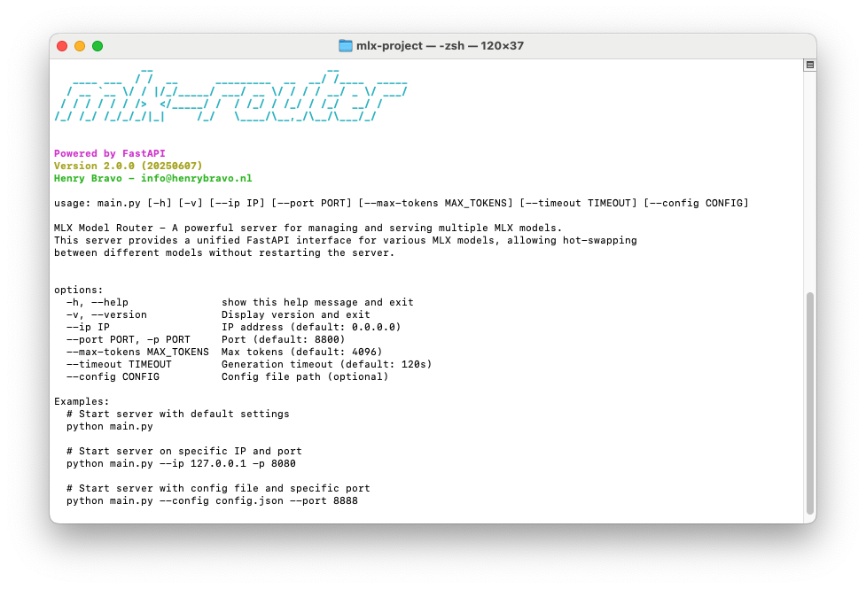
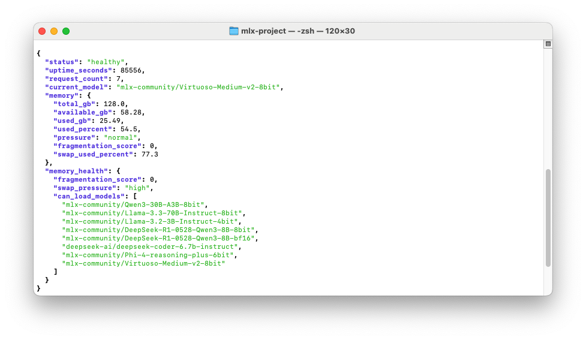

# mlx-project
Useful scripts to ease the use of mlx

## MLX Model Router v2.0.0

A powerful and efficient server for managing and serving multiple MLX models through a unified API interface. Now powered by **FastAPI** for modern, high-performance API handling with automatic OpenAPI documentation.



## Features

- 🚀 **FastAPI-powered** - Modern async API with automatic documentation
- 🔄 Hot-swap between different models without server restart
- ⚡ MLX-optimized performance with GPU acceleration
- 🔒 Automatic memory management and cleanup
- 🎯 **Full OpenAI API compatibility** - Drop-in replacement for OpenAI endpoints
- ⏱️ Built-in timeout protection and error handling
- 📊 Comprehensive logging system with rotation
- 🏗️ **Modular architecture** - Clean separation of concerns
- 📖 **Interactive API docs** - Automatic Swagger/OpenAPI documentation

## Supported Models

Any mlx model that is available locally and added to the list (in the script). As an example the router currently supports the following models:
- `mlx-community/Qwen3-30B-A3B-8bit`
- `mlx-community/Llama-3.3-70B-Instruct-8bit`
- `mlx-community/Llama-3.2-3B-Instruct-4bit`
- `mlx-community/DeepSeek-R1-0528-Qwen3-8B-8bit`
- `mlx-community/DeepSeek-R1-0528-Qwen3-8B-bf16`
- `deepseek-ai/deepseek-coder-6.7b-instruct`
- `mlx-community/Phi-4-reasoning-plus-6bit`

You can use the `--config` argument to load external model configurations from `config.json`.

You can use the helper tools in `helper_tools/` directory:
- `mlx_downloader.py` - Download MLX models
- `mlx_lmstudio_linker.py` - Link models to LM Studio
- `mlx_model_parameter_discovery_tool.py` - Auto-discover optimal parameters

## Architecture v2.0.0

The project now features a clean modular architecture:

### Package Structure
```
mlx_router/
├── config/          # Configuration management
│   └── model_config.py
├── core/            # Core MLX logic
│   ├── model_manager.py
│   └── resource_monitor.py
└── api/             # FastAPI application
    └── app.py
```

### Core Components
- **MLXModelManager**: Central class managing model loading, unloading, and generation with thread-safe operations
- **ModelConfig**: Configuration management for model-specific parameters
- **ResourceMonitor**: Apple Silicon memory monitoring and optimization
- **FastAPI App**: Modern HTTP API with automatic documentation

### Configuration System
- **config.json**: External configuration file for model parameters, defaults, and operational settings
- Model-specific parameters include: max_tokens, temperature, top_p, top_k, min_p, chat_template, required_memory_gb
- Memory pressure-aware token limits for different system states

### Chat Template System
The router supports multiple chat template formats:
- `llama3`: Llama 3.x models with `<|begin_of_text|>` format
- `deepseek`: DeepSeek models with instruction/response format
- `qwen`: Qwen models with `<|im_start|>` format  
- `phi4`: Phi-4 models with `<|user|>/<|assistant|>` format
- `generic`: Fallback template



## Prerequisites

- Python 3.10+ (tested with 3.11 and 3.13)
- MLX-compatible GPU
- `uv` package manager (recommended)

## Installation

1. Clone the repository:
```bash
git clone https://github.com/henrybravo/mlx-project.git
cd mlx-project
```

2. Set up the environment using `uv`:
```bash
pip install uv
uv venv --python 3.11 # uv venv
source .venv/bin/activate
uv pip install -r requirements.txt
```

## Usage

*Optionally: view help menu first:*
```bash
python main.py -h
```

1. Start the server:
```bash
python main.py --config config.json
```

2. **Interactive API Documentation:**
The server will start on `http://0.0.0.0:8800` by default.
- **Swagger UI**: http://localhost:8800/docs
- **ReDoc**: http://localhost:8800/redoc

### API Endpoints

- `GET /v1/models` - List available models with memory requirements
- `POST /v1/chat/completions` - Generate chat completions (OpenAI compatible)
- `GET /health` - Server health check
- `GET /v1/health` - Detailed health metrics

### Example API Usage

**List Models:**
```bash
curl -s http://localhost:8800/v1/models | jq
```

**Chat Completion:**
```bash
curl -s -X POST http://localhost:8800/v1/chat/completions \
  -H "Content-Type: application/json" \
  -d '{
    "model": "mlx-community/Llama-3.2-3B-Instruct-4bit",
    "messages": [
      {"role": "user", "content": "Hello, how are you?"}
    ],
    "temperature": 0.7,
    "max_tokens": 1000
  }' | jq
```

**Health Check:**
```bash
curl -s http://localhost:8800/health | jq
```

## Configuration

The `config.json` file allows you to:
- Define model-specific parameters (temperature, max_tokens, etc.)
- Set memory pressure thresholds for different system states
- Configure default values and operational settings
- Add new models with custom chat templates

Example configuration structure:
```json
{
  "defaults": {
    "max_tokens": 4096,
    "timeout": 120
  },
  "models": {
    "model-name": {
      "max_tokens": 8192,
      "temp": 0.7,
      "chat_template": "llama3",
      "required_memory_gb": 8
    }
  }
}
```

## What's New in v2.0.0

- **FastAPI Integration** - Modern async API framework with automatic documentation
- **Modular Architecture** - Clean separation into config/, core/, and api/ modules
- **Enhanced Error Handling** - Comprehensive HTTP status codes and error responses
- **Interactive Documentation** - Built-in Swagger UI and ReDoc interfaces
- **Improved Performance** - Async request handling and optimized memory management
- **Better Monitoring** - Enhanced health endpoints with detailed system metrics

## Logging

Logs are written to both console and `logs/mlx_router.log` file with rotation, providing detailed information about:
- Model loading/unloading with timing metrics
- API requests with unique request IDs
- Generation statistics and performance metrics
- Memory pressure monitoring and adjustments
- Comprehensive error tracking with stack traces

## Contributing

Contributions are welcome! Please feel free to submit a Pull Request.

## License

MIT License