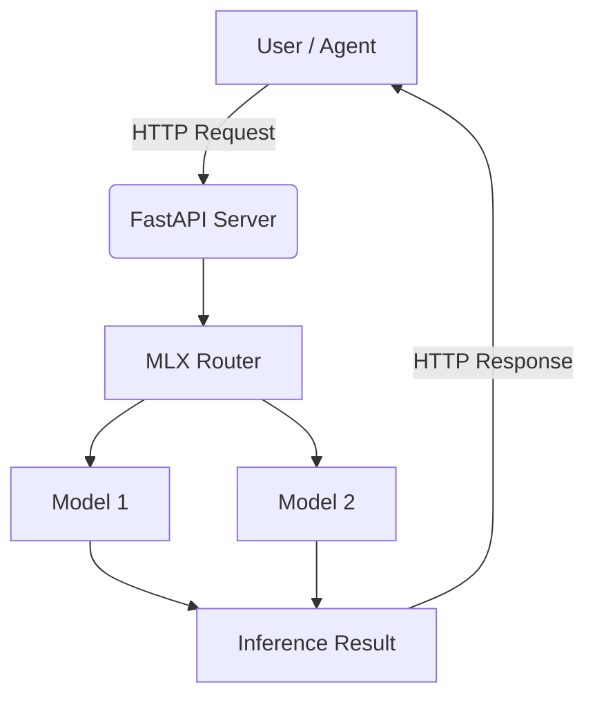

# MLX Router

[](https://www.python.org/downloads/)
[](https://github.com/ml-explore/mlx)
[](https://github.com/ml-explore/mlx-lm)
[](https://github.com/Blaizzy/mlx-vlm)
[](https://fastapi.tiangolo.com/)
[](https://huggingface.co/docs/huggingface_hub)
[](https://opensource.org/licenses/MIT)
[](https://github.com/henrybravo/mlx-router)

An OpenAI-compatible inference server optimized for **Apple Silicon**. Hot-swap between MLX models, stream responses in real-time, process images and PDFs, and integrate with any OpenAI client.


## Features

- 🚀 **FastAPI-powered** - Modern async API with automatic documentation
- 🔄 Hot-swap between different models without server restart
- ⚡ MLX-optimized performance with GPU acceleration
- 🔒 Automatic memory management and cleanup
- 🎯 **Full OpenAI API compatibility** - Drop-in replacement for OpenAI endpoints
- ⏱️ Built-in timeout protection and error handling
- 📊 Comprehensive logging system with rotation
- 🏗️ **Modular architecture** - Clean separation of concerns
- 📖 **Interactive API docs** - Automatic Swagger/OpenAPI documentation
- 🔧 **System service support** - Install as macOS launchd service with automatic startup and crash recovery
- 🌊 **Response Streaming** - Real-time token delivery with Server-Sent Events (90%+ latency reduction)
- 🔧 **Function Calling** - OpenAI-compatible tool/function calling for agent frameworks
- 👁️ **Vision Model Support** - Process images and PDFs with multimodal models (mlx-vlm)

## Supported Models

MLX Router supports **any MLX model** that is available locally. Models are automatically discovered from configured directories and can be loaded dynamically without server restart.

### Local Model Directory Support

Models are loaded from local directories (default: `$HOME/models`) with automatic configuration detection:

- **Automatic Discovery**: Models placed in the configured directory are automatically detected
- **Dynamic Configuration**: Model parameters are extracted from local `config.json` files
- **Hot-Swapping**: Switch between models without restarting the server
- **Fallback Support**: Downloads any HuggingFace model to the custom directory if not found locally
- **Cache Management**: Existing models in `~/.cache/huggingface/hub` can be symlinked to the custom directory

### Currently Configured Models

Example model configurations are provided in `config.json`. Use `helper_tools/mlx_downloader.py` to download these models to your local directory before starting the server.

### Model Directory Structure

```
$HOME/models/
├── mlx-community--Llama-3.3-70B-Instruct-4bit/
│   └── snapshots/
│       └── [commit-hash]/
│           ├── config.json
│           ├── tokenizer.json
│           └── model.safetensors
└── custom-models/
    └── my-model/
        ├── config.json
        ├── tokenizer.json
        └── model.safetensors
```

Use the `--config` argument to load additional model configurations from `config.json`.

You can use the helper tools in `helper_tools/` directory:
- `mlx_downloader.py` - Download MLX models to custom directories (supports `MLX_MODEL_DIR`)
- `mlx_lmstudio_linker.py` - Link models to LM Studio
- `mlx_model_parameter_discovery_tool.py` - Auto-discover optimal parameters

## Architecture



The project features a clean modular architecture:

### Package Structure
```
mlx_router/
├── api                    ## FastAPI application
│   └── app.py              # API endpoint handlers
├── config                 ## Configuration management 
│   └── model_config.py     # ModelConfig class
└── core                   ## Core MLX logic     
    ├── content.py          # Content normalization utilities
    ├── manager.py          # MLXModelManager class
    ├── patterns.py         # Chat template patterns
    ├── resource_monitor.py # Memory monitoring
    └── templates.py        # Chat template handling 
```

### Core Components
- **MLXModelManager**: Central class managing model loading, unloading, and generation with thread-safe operations
- **ModelConfig**: Configuration management for model-specific parameters
- **ResourceMonitor**: Apple Silicon memory monitoring and optimization
- **FastAPI App**: Modern HTTP API with automatic documentation

### Configuration System
- **config.json**: External configuration file for model parameters, defaults, and operational settings
- Model-specific parameters include: max_tokens, temperature, top_p, top_k, min_p, chat_template, required_memory_gb
- Memory pressure-aware token limits for different system states

### Chat Template System
The router supports multiple chat template formats:
- `llama3`: Llama 3.x models with `<|begin_of_text|>` format
- `deepseek`: DeepSeek models with instruction/response format
- `qwen`: Qwen models with `<|im_start|>` format  
- `phi4`: Phi-4 models with `<|user|>/<|assistant|>` format
- `generic`: Fallback template
- `chatml`: OpenAI ChatML format
- `gpt-oss`: GPT-OSS models with custom format

## Prerequisites

- Python 3.11+ (tested with 3.11 and 3.13)
- MLX-compatible GPU
- `uv` package manager (recommended)

## Installation

### Development Installation

1. Clone the repository:
```bash
git clone https://github.com/henrybravo/mlx-router.git
cd mlx-router
```

2. Set up the environment using `uv`:
```bash
pip install uv
uv venv --python 3.11
source .venv/bin/activate
uv pip install -r requirements.txt
```

### System Service Installation (macOS)

For production deployment as a user service that starts automatically:

**Prerequisites:**
- macOS (Darwin-based system)
- Python 3.11+ installed
- `uv` package manager (optional, but recommended for faster installation)

```bash
# Install as a user service (no sudo required)
./install-launchd.sh

# Check service status
launchctl list | grep mlx-router

# View logs
tail -f ~/mlx_router_app/logs/mlx_router.log
```

**Installation Features:**
- ✅ **Automatic dependency checking**: Validates Python version and required files
- ⚡ **uv support**: Uses `uv` for faster package installation if available, falls back to pip
- 🔄 **Existing service handling**: Safely handles reinstallation over existing services
- 🧪 **Installation verification**: Tests service startup and API availability
- 🔧 **Self-healing dependencies**: Automatically detects and fixes missing Python packages
- 🎯 **Application testing**: Verifies main.py imports work before service installation
- 🏠 **User-space installation**: Installs to `~/mlx_router_app` without requiring elevated privileges

**Configuration in Production Mode:**

The installation script automatically:
- Copies `config.json` to `~/mlx_router_app/config.json`
- Configures the service to use this user-level config file
- The service runs with `--config ~/mlx_router_app/config.json`
- **Enables automatic restart**: Service automatically restarts if the application crashes
- **Login persistence**: Service starts automatically when you log in

**Modifying Production Configuration:**
```bash
# Backup current config (recommended)
cp ~/mlx_router_app/config.json ~/mlx_router_app/config.json.backup

# Edit the production config file
nano ~/mlx_router_app/config.json

# Restart service to apply changes
launchctl unload ~/Library/LaunchAgents/com.henrybravo.mlx-router.plist
launchctl load ~/Library/LaunchAgents/com.henrybravo.mlx-router.plist

# Verify changes in logs
tail -f ~/mlx_router_app/logs/mlx-router.log
```

**Service Management:**
```bash
# Stop service
launchctl unload ~/Library/LaunchAgents/com.henrybravo.mlx-router.plist

# Start service
launchctl load ~/Library/LaunchAgents/com.henrybravo.mlx-router.plist

# Uninstall service
./uninstall-launchd.sh
```

**Custom Installation Directory:**
```bash
# Install to a custom directory
INSTALL_DIR=/path/to/custom/dir ./install-launchd.sh

# Or set the environment variable first
export INSTALL_DIR=/path/to/custom/dir
./install-launchd.sh
```

## Usage

### Development Mode

*Optionally: view help menu first:*
```bash
python main.py -h
```

1. Start the server:
```bash
python main.py --config config.json
```

### Production Mode (User Service)

Once installed as a user service, MLX Router runs automatically and can be accessed immediately:
```bash
# Service runs automatically after installation
# Access API directly
curl -s http://localhost:8800/health | jq
```


### Access Points

The server will start on `http://0.0.0.0:8800` by default.
- **Swagger UI**: http://localhost:8800/docs
- **ReDoc**: http://localhost:8800/redoc

### API Endpoints

- `GET /v1/models` - List available models with memory requirements
- `POST /v1/chat/completions` - Generate chat completions (OpenAI compatible)
- `GET /health` - Server health check
- `GET /v1/health` - Detailed health metrics

### Example API Usage

**List Models:**
```bash
curl -s http://localhost:8800/v1/models | jq
```

**Chat Completion:**
```bash
curl -s -X POST http://localhost:8800/v1/chat/completions \
  -H "Content-Type: application/json" \
  -d '{
    "model": "mlx-community/gpt-oss-120b-MXFP4-Q8",
    "messages": [
      {"role": "user", "content": "Hello, how are you?"}
    ],
    "temperature": 0.7,
    "stream": false,
    "max_tokens": 1024
  }' | jq -r '.choices[0].message.content'
```

**Streaming Response:**

```bash
# asuming you have "stream": true in config.json
curl -s -X POST http://localhost:8800/v1/chat/completions \
  -H "Content-Type: application/json" \
  -d '{
    "model": "mlx-community/Llama-3.3-70B-Instruct-4bit",
    "messages": [
      {"role": "user", "content": "Write a short poem about technology"}
    ]
  }'
```

```bash
curl -sN -X POST http://localhost:8800/v1/chat/completions \
  -H "Content-Type: application/json" \
  -d '{
    "model": "mlx-community/Llama-3.3-70B-Instruct-4bit",
    "messages": [{"role": "user", "content": "Write a short poem about technology"}],
    "stream": true
  }' | sed -n 's/^data: //p' | grep -v '^\[DONE\]' | jq -rj '.choices[0].delta.content // empty' && echo
```

**Function Calling:**
```bash
curl -s -X POST http://localhost:8800/v1/chat/completions \
  -H "Content-Type: application/json" \
  -d '{
    "model": "mlx-community/Llama-3.3-70B-Instruct-4bit",
    "messages": [
      {"role": "user", "content": "What is the weather like in San Francisco?"}
    ],
    "tools": [
      {
        "type": "function",
        "function": {
          "name": "get_weather",
          "description": "Get current weather information for a location",
          "parameters": {
            "type": "object",
            "properties": {
              "location": {
                "type": "string",
                "description": "The city and state, e.g. San Francisco, CA"
              },
              "units": {
                "type": "string",
                "enum": ["celsius", "fahrenheit"],
                "description": "Temperature units"
              }
            },
            "required": ["location"]
          }
        }
      }
    ],
    "max_tokens": 150
  }' | jq
```

**Health Check:**
```bash
curl -s http://localhost:8800/v1/health | jq
```

## Vision Model Support

MLX Router supports vision/multimodal models for processing images and PDFs using the OpenAI-compatible multimodal content format. This feature uses [mlx-vlm](https://github.com/Blaizzy/mlx-vlm) for vision model inference.

### Supported Input Types

- **Images**: PNG, JPEG, WebP, BMP (via base64 data URI)
- **PDFs**: Automatically converted to images (requires `poppler`)

### Prerequisites

For PDF support, install `poppler`:

```bash
# macOS (Homebrew)
brew install poppler
```

### Configuration

Add `"supports_vision": true` to your model configuration:

```json
{
  "models": {
    "mlx-community/chandra-8bit": {
      "max_tokens": 8192,
      "temp": 0.7,
      "chat_template": "generic",
      "required_memory_gb": 4,
      "supports_tools": false,
      "supports_vision": true
    }
  }
}
```

### Example: Image OCR

```bash
# Encode image to base64 and send request
IMAGE_BASE64=$(base64 -i /path/to/image.png)
curl -s -X POST http://localhost:8800/v1/chat/completions \
  -H "Content-Type: application/json" \
  -d '{
    "model": "mlx-community/chandra-8bit",
    "messages": [
      {
        "role": "user",
        "content": [
          {
            "type": "image_url",
            "image_url": {
              "url": "data:image/png;base64,'"$IMAGE_BASE64"'"
            }
          },
          {
            "type": "text",
            "text": "OCR this image and extract all text"
          }
        ]
      }
    ],
    "max_tokens": 2048,
    "stream": false
  }' | jq -r '.choices[0].message.content'
```

### Example: PDF OCR

```bash
# Encode PDF to base64 and send request
PDF_BASE64=$(base64 -i /path/to/document.pdf)
curl -s -X POST http://localhost:8800/v1/chat/completions \
  -H "Content-Type: application/json" \
  -d '{
    "model": "mlx-community/chandra-8bit",
    "messages": [
      {
        "role": "user",
        "content": [
          {
            "type": "image_url",
            "image_url": {
              "url": "data:application/pdf;base64,'"$PDF_BASE64"'"
            }
          },
          {
            "type": "text",
            "text": "OCR this document"
          }
        ]
      }
    ],
    "max_tokens": 4096,
    "stream": false
  }' | jq -r '.choices[0].message.content'
```

### Tested Models

- **[mlx-community/chandra-8bit](https://huggingface.co/mlx-community/chandra-8bit)** - High-accuracy OCR model based on Qwen3-VL, excellent for document text extraction

Other mlx-vlm compatible vision models should also work (e.g., LLaVA, Qwen-VL variants).

### Client Integration

Vision features have been tested with:
- **curl** - Direct API calls (examples above)
- **tests/test_vision_model.py** - Automated test script for vision model functionality
- **OpenWebUI** - Web interface with image upload support
- **Python requests** - Programmatic access via test scripts

For a complete test script, see `tests/test_vision_model.py`.

## Configuration

The `config.json` file allows you to:
- Define model-specific parameters (temperature, max_tokens, etc.)
- Set memory pressure thresholds for different system states
- Configure default values and operational settings
- Add new models with custom chat templates

### Configuration Locations

**Development Mode:**
- Use local `config.json` in project directory
- Specify with `python main.py --config config.json`

**Production Mode (User Service):**
- Configuration automatically copied to `~/mlx_router_app/config.json`
- Service configured to use this user-level config
- Edit with: `nano ~/mlx_router_app/config.json`
- Restart service after changes to apply modifications

### Configuration Reference

#### `defaults` Section

Global settings that apply to all models unless overridden:

| Parameter | Type | Default | Description |
|-----------|------|---------|-------------|
| `max_tokens` | int | 4096 | Maximum tokens for generation |
| `timeout` | int | 120 | Generation timeout in seconds |
| `cache_size` | int | 2 | Number of models to keep cached |
| `memory_threshold_gb` | float | 80.0 | Memory threshold for pressure calculations |
| `safety_margin` | float | 1.2 | Multiplier for model memory requirements (1.2 = 20% buffer) |
| `swap_critical_percent` | float | 90.0 | Swap usage % that triggers critical pressure |
| `swap_high_percent` | float | 75.0 | Swap usage % that triggers high pressure |
| `stream` | bool | false | Enable streaming responses by default |
| `stream_chunk_size` | int | 8 | Number of tokens per streaming chunk |
| `streaming_format` | string | "sse" | Format: "sse", "json_lines", or "json_array" |
| `warmup_tokens` | int | 5 | Tokens generated during model warmup |
| `enable_function_calling` | bool | true | Enable tool/function calling support |
| `model` | string | - | Default model to preload on startup |
| `model_directory` | string | "$HOME/models" | Path to local model storage |

#### `server` Section

Network and server configuration:

| Parameter | Type | Default | Description |
|-----------|------|---------|-------------|
| `ip` | string | "0.0.0.0" | IP address to bind to |
| `port` | int | 8800 | Port number |
| `debug` | bool | false | Enable debug logging |

#### `models` Section

Per-model configuration. Each model entry uses the model ID as key:

| Parameter | Type | Required | Description |
|-----------|------|----------|-------------|
| `max_tokens` | int | No | Maximum tokens for this model |
| `temp` | float | No | Temperature (0.0-2.0, lower = more deterministic) |
| `top_p` | float | No | Nucleus sampling threshold (0.0-1.0) |
| `top_k` | int | No | Top-k sampling limit |
| `min_p` | float | No | Minimum probability threshold |
| `chat_template` | string | Yes | Template format: "llama3", "qwen", "deepseek", "phi4", "chatml", "gpt-oss", "generic" |
| `reasoning_response` | string | No | "enable" or "disable" - for models with reasoning output (e.g., GPT-OSS, Phi-4) |
| `required_memory_gb` | float | Yes | RAM required to load the model |
| `supports_tools` | bool | No | Whether model supports function calling |
| `supports_vision` | bool | No | Whether model supports image/PDF input (requires mlx-vlm) |
| `memory_pressure_max_tokens` | object | No | Token limits per pressure level (see below) |

#### `memory_pressure_max_tokens` Object

Dynamic token limits based on system memory pressure:

| Key | Description |
|-----|-------------|
| `normal` | Token limit when memory is abundant |
| `moderate` | Token limit under moderate pressure |
| `high` | Token limit under high pressure |
| `critical` | Token limit under critical pressure |

### Example Configuration

```json
{
  "defaults": {
    "max_tokens": 8192,
    "timeout": 120,
    "cache_size": 2,
    "memory_threshold_gb": 2.0,
    "safety_margin": 0.9,
    "swap_critical_percent": 99.0,
    "swap_high_percent": 90.0,
    "stream": true,
    "stream_chunk_size": 32,
    "streaming_format": "sse",
    "warmup_tokens": 5,
    "enable_function_calling": true,
    "model": "mlx-community/NVIDIA-Nemotron-3-Nano-30B-A3B-4bit",
    "model_directory": "/Users/username/models"
  },
  "server": {
      "ip": "10.3.2.1",
      "port": 8800,
      "debug": false
  },
  "models": {
      "mlx-community/chandra-8bit": {
          "max_tokens": 8192,
          "temp": 0.7,
          "top_p": 0.9,
          "top_k": 50,
          "min_p": 0.05,
          "chat_template": "generic",
          "required_memory_gb": 4,
          "supports_tools": false,
          "supports_vision": true
      },
      "mlx-community/NVIDIA-Nemotron-3-Nano-30B-A3B-4bit": {
          "max_tokens": 16384,
          "temp": 0.7,
          "top_p": 0.9,
          "top_k": 40,
          "min_p": 0.05,
          "chat_template": "generic",
          "reasoning_response": "enable",
          "required_memory_gb": 40,
          "memory_pressure_max_tokens": {
                  "normal": 16384,
                  "moderate": 16384,
                  "high": 16384,
                  "critical": 8192
          }
      },
}
```

### Streaming Format Configuration

MLX Router supports three streaming formats for maximum client compatibility:

| Format | Configuration | Best For | Response Type |
|--------|---------------|----------|---------------|
| **SSE** (default) | `"streaming_format": "sse"` | curl, Python requests, OpenWebUI, Goose | `data: {json}\n\n...` |
| **JSON Lines** | `"streaming_format": "json_lines"` | Advanced clients | `{json}\n{json}\n...` |
| **JSON Array** | `"streaming_format": "json_array"` | Goose, OpenWebUI | `{"object": "chat.completion", "choices": [...]}` |

**SSE is the OpenAI standard** - most clients (OpenWebUI, Python openai lib, etc.) expect it by default and I recommend using it unless your client and LLM require a different format.

### Model Directory Configuration

- **`model_directory`**: Path to local model storage (default: `"$HOME/models"`)
- **Environment Variable**: `MLX_MODEL_DIR` can override the config setting
- **Automatic Discovery**: Models placed in this directory are automatically detected
- **HuggingFace Cache Format**: Supports both direct directories and HF cache naming (`models--org--model`)

## Memory Pressure Management

Memory pressure management is a critical feature in MLX Router that enables efficient operation on Apple Silicon systems with varying amounts of RAM. This system prevents system instability by dynamically adjusting model behavior based on current memory usage.

Read more about memory pressure management in the [MEMORY_PRESSURE.md](docs/MEMORY_PRESSURE.md) document.

## Logging

### Development Mode
Logs are written to both console and `logs/mlx_router.log` file.

### Production Mode (User Service)
Logs are written to application log files:
- **Standard Output**: `~/mlx_router_app/logs/mlx_router.log`
- **Error Output**: `~/mlx_router_app/logs/mlx_router.error.log`

**Log Information:**
- Model loading/unloading with timing metrics
- API requests with unique request IDs
- Generation statistics and performance metrics
- Memory pressure monitoring and adjustments
- Comprehensive error tracking with stack traces

**View Logs:**
```bash
# Real-time monitoring
tail -f ~/mlx_router_app/logs/mlx_router.log

# View recent entries
tail -50 ~/mlx_router_app/logs/mlx_router.log

# Check for errors
tail -50 ~/mlx_router_app/logs/mlx_router.error.log
```

## Crash Recovery & Reliability

### Automatic Restart (Production Mode)

The launchd service is configured with `KeepAlive=true`, providing robust crash recovery:

- **Automatic Restart**: If the Python process crashes (malloc errors, segfaults, etc.), launchd automatically restarts the service
- **Login Persistence**: Service starts automatically when you log in
- **Process Monitoring**: launchd continuously monitors the process health
- **Crash Logging**: All crashes and restarts are logged to `~/mlx_router_app/logs/mlx_router.error.log`

**Monitor Crash Recovery:**
```bash
# Watch for service restarts in real-time
tail -f ~/mlx_router_app/logs/mlx_router.log | grep -E "(Starting|Stopping|Error)"

# Check crash history
grep -i "crash\|error\|restart" ~/mlx_router_app/logs/mlx_router.error.log

# View service status and restart count
launchctl print gui/$(id -u)/com.henrybravo.mlx-router
```

**Example Crash Recovery Flow:**
1. Application crashes due to memory error or segfault
2. launchd detects process termination
3. Service automatically restarts within seconds
4. API becomes available again without manual intervention
5. Crash details logged for debugging

## Installation Testing

A comprehensive testing guide is available in [INSTALL_TEST.md](docs/INSTALL_TEST.md). For quick verification:

```bash
# Test system service installation
./install-launchd.sh

# Verify endpoints are responding
curl -s http://localhost:8800/health | jq
curl -s http://localhost:8800/v1/models | jq

# Test chat completion
curl -s -X POST http://localhost:8800/v1/chat/completions \
  -H "Content-Type: application/json" \
  -d '{
    "model": "mlx-community/NVIDIA-Nemotron-3-Nano-30B-A3B-4bit",
    "messages": [{"role": "user", "content": "What existed first: the chicken or the egg?"}],
    "stream": false,
    "max_tokens": 1024
  }' | jq -r '.choices[0].message.content'
```

## Troubleshooting

### Service Issues
```bash
# Check service status
launchctl print gui/$(id -u)/com.henrybravo.mlx-router

# Manual start for debugging
~/mlx_router_app/venv/bin/python \
  ~/mlx_router_app/main.py \
  --config ~/mlx_router_app/config.json

# Restart service
launchctl unload ~/Library/LaunchAgents/com.henrybravo.mlx-router.plist
launchctl load ~/Library/LaunchAgents/com.henrybravo.mlx-router.plist
```

### Common Issues

**Installation Issues:**
- **Python version too old**: Install Python 3.11+ before running the install script
- **Missing files**: Ensure all required files are present in the project directory
- **Permission denied**: The install script now runs in user space and doesn't require sudo
- **uv not found warning**: Install `uv` globally with `pip install uv` for faster installation (optional)
- **Missing dependencies**: The install script automatically detects and fixes missing dependencies
- **Installation failure**: Re-run `./install-launchd.sh` - it includes self-healing dependency resolution

**Runtime Issues:**
- **Service won't start**: Check error logs and verify Python dependencies
- **API not responding**: Ensure port 8800 is available and not blocked
- **Model loading fails**: Verify models exist and have sufficient memory
- **Config changes not applied**: Restart the service after modifying `~/mlx_router_app/config.json`
- **Invalid config format**: Validate JSON syntax with `python -m json.tool ~/mlx_router_app/config.json`
- **Memory-related crashes**: MLX memory errors automatically trigger service restart (production mode)
- **Frequent crashes**: Check error logs for patterns and ensure sufficient system memory for models
- **High memory pressure**: Adjust model parameters or reduce max_tokens in config
- **stream chunk_size too large**: Reduce `stream_chunk_size` in config for lower latency
- **stream chunk_size too small**: Increase `stream_chunk_size` for better throughput - Goose does not work well with very small chunks
- **LLM behavior issues**: Adjust temperature, top_p, and top_k settings in model config or test with different models
- **safety_margin**: can be 0.2 to 1.5 - higher values use more memory but reduce OOM risk
- **memory_threshold_gb**: set according to system RAM - lower values trigger pressure adjustments sooner
- **swap_critical_percent** and **swap_high_percent**: adjust based on system swap usage patterns, higher values delay pressure triggers
- **streaming_format**: ensure client compatibility with selected format (sse, json_lines, json_array) but sse is recommended for most clients
- **function calling issues**: ensure `enable_function_calling` is true and model supports it
- **vision model issues**: ensure `supports_vision` is true and mlx-vlm is installed for image/PDF processing
- **poppler not found**: install poppler for PDF support (e.g., `brew install poppler` on macOS)
- **model not found**: ensure model is downloaded to the configured model directory
- **insufficient memory**: reduce model size or max_tokens, or increase system RAM/swap
- **log files not found**: verify installation directory and log paths
- **crash recovery not working**: ensure service is installed with launchd and check logs for errors
- **service restart loops**: check error logs for root cause, may indicate insufficient memory or config issues
- **warmup tokens causing delays**: reduce `warmup_tokens` in config for faster startup at the cost of initial latency

## Agent Framework Integration

MLX Router's OpenAI-compatible API enables seamless integration with popular agent frameworks and AI applications: for comprehensive setup guides and examples, see **[AGENTS_INTEGRATION.md](docs/AGENTS_INTEGRATION.md)**

## Contributing

Contributions are welcome! Please feel free to submit a Pull Request or open an Issue.

## License

MIT License